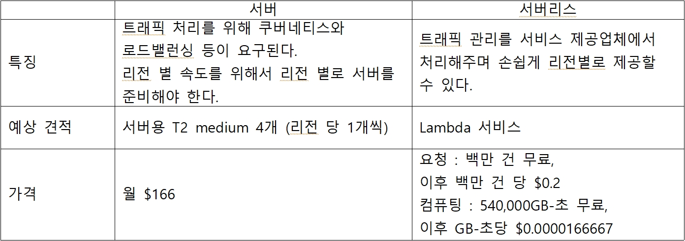
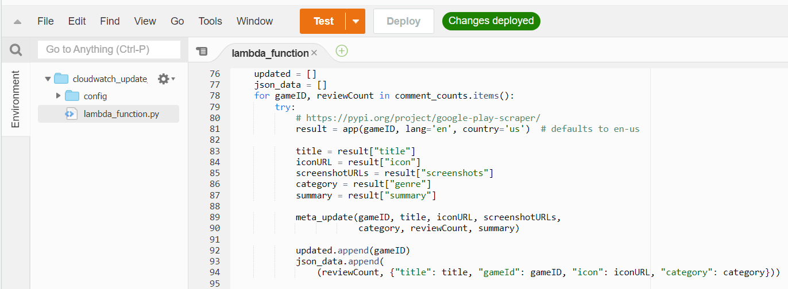
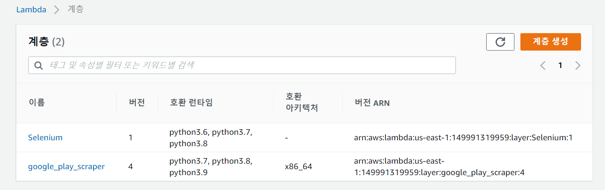
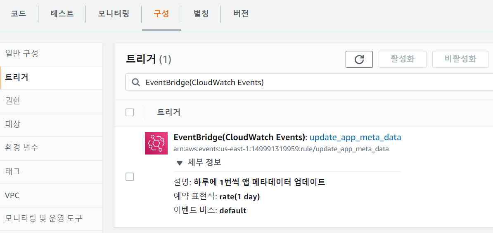
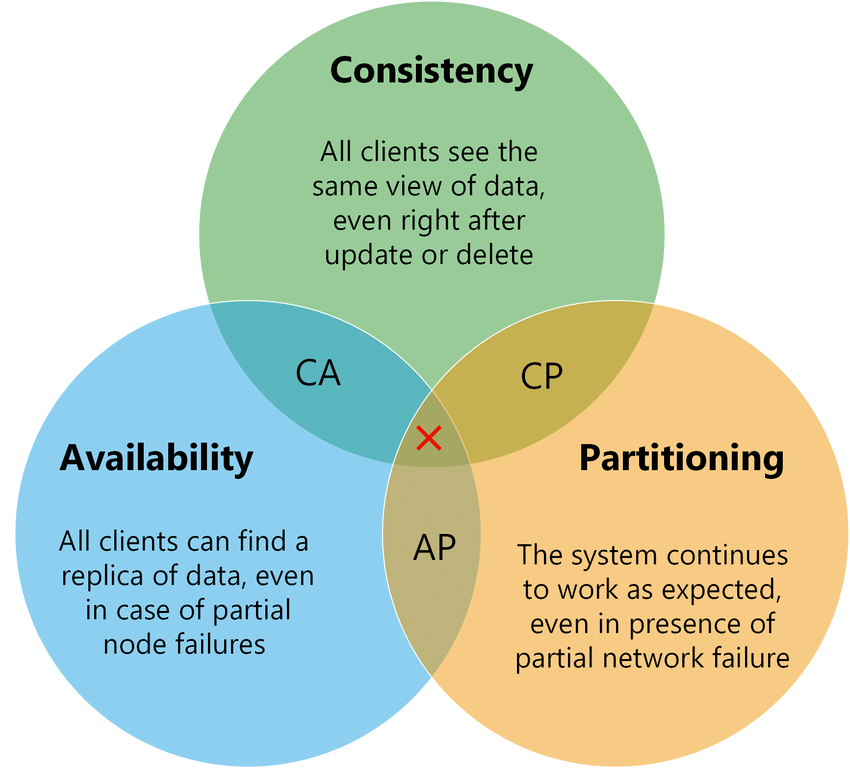

<!-- @format -->

# Real Gamer's Critics

## 설명

ㅇ 프로젝트 세부 산출물(개발 개발물, 제작물)

이번 프로젝트에서의 목표는 모바일 게임을 좋아하는 사람들을 위한 커뮤니티 서비스이다. 이러한 커뮤니티는 오랫동안 유지되며 사용자를 모아야 하므로 서비스를 운영하는데 부담이 가면 힘들다. 그렇기에 이번 프로젝트에서 초점을 둔 부분은 낮은 유지비용으로 지속 가능한 서비스를 구축하는 것이다.

---

## 서버

● 글로벌 앱 특성상 큰 트래픽 처리와 리전 별 동일한 접근 속도가 요구됨 
● 이를 만족시키는 서버 구축법엔 기존 방식과 서버리스 방식이 있음

---

## 크롤러

● 앱의 메타데이터를 위해 플레이스토어 크롤러를 Lambda로 구현함 

● google-play-scraper 라이브러리를 Layer에 올려서 사용 

● CloudWatch를 이용하여 하루에 한 번 동작하도록 설정함 

---

## 데이터베이스

● 데이터베이스는 CAP 세 가지를 모두 만족할 수 없어 목적에 따라 이 중 두 가지를 선택하게 됨 
● Real Gamer’s critics은 글로벌 앱 특성상 많은 트래픽을 처리를 요구받게 되어 Availability가 요구됨 
● 다양한 리전에서 사용되므로 Partition Tolerance가 요구됨 
● AP를 만족하는 DB 중에서 AWS에서 제공해주는 DynamoDB를 선택함 

● key-value 형식의 구조 
● 확장이 단순하고 신속함 
● 데이터 속성 추가 및 변경이 자유로움 
● 빠르고 일관된 응답시간 
● 보조 인덱스를 통한 빠른 조회 
